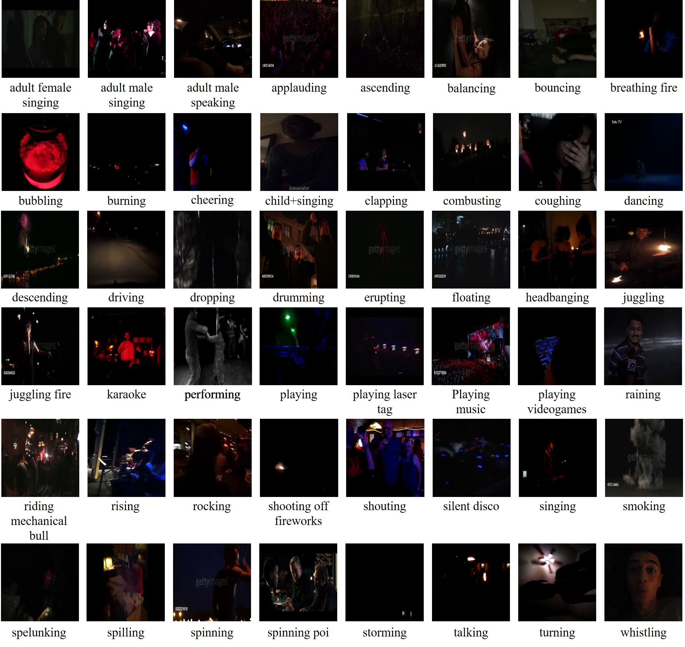
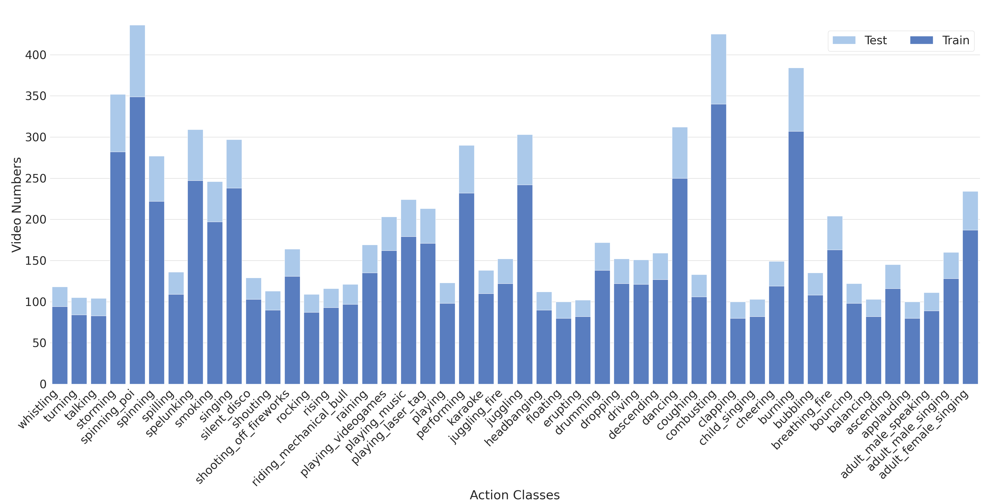

# Dark-48
Dark-48: a dark video dataset for action recognition in the dark. 

Dark-48 is a dark video dataset created for action recognition in the dark, collected from [Kinetics700](https://arxiv.org/abs/2010.10864) and [MiT](https://arxiv.org/abs/1801.03150), contains 8815 dark videos belong to 48 action classes. To overcome the limitations (fewer scenes and fewer categories) of the existing dark video action recognition dataset (e.g. [ARID](https://xuyu0010.github.io/arid.html)) , we build this dataset to provide more dark videos, more categories and richer scenes.

## Download

The full dataset can be downloaded from:
* [baidu](https://pan.baidu.com/s/1Hs-0S908vr8INvlvnQLnig?pwd=dk18),   code: `dk18` 

## Categories
The action categories for Dark-48 data set are: 

'''
adult+female+singing,
adult+male+singing,
adult+male+speaking,
applauding,
ascending,
balancing,
bouncing,
breathing fire,
bubbling,
burning,
cheering,
child+singing,
clapping,
combusting,
coughing,
dancing,
descending,
driving,
dropping,
drumming,
erupting,
floating,
headbanging,
juggling,
juggling fire,
karaoke,
performing,
playing,
playing laser tag,
playing+music,
playing+videogames,
raining,
riding mechanical bull,
rising,
rocking,
shooting off fireworks,
shouting,
silent disco,
singing,
smoking,
spelunking,
spilling,
spinning,
spinning poi,
storming,
talking,
turning,
whistling
'''


Here the examples for each category:



## Statistics


## Dark Video Evaluation
The source code of the proposed dark video evaluation method for dark videos collection.
```
import os
import cv2
import numpy as np
from decord import VideoReader

def dark_img(img, threshold = 0.877):
    YCrCb = cv2.cvtColor(img, cv2.COLOR_RGB2YCrCb)
    Y = YCrCb[:,:,0]
    # Determine whether image is bright or dimmed
    exp_in = 112 # Expected global average intensity 
    M,N = img.shape[:2]
    mean_in = np.sum(Y/(M*N)) 
    t = (mean_in - exp_in)/ exp_in
    
    # Check image
    if t < -threshold: # Dimmed Image
        return True
    else:
        return False

def dark_video(video, segments=8, threshold = 0.877):
    vr = VideoReader(video)
    seg = int(len(vr) / segments)
    sample_id = [seg*i+int(seg/2) for i in range(0, segments)]
    frames = vr.get_batch(sample_id).asnumpy()
    video_t = 0
    for i in range(len(sample_id)):
        img = frames[i]
        img_t = dark_img(img)
        video_t += img_t
    if video_t/segments >= threshold:
        return True
    else:
        return False
```

## Contact
If you have any questions about the Dark-48 dataset, please contact:


```
yzliu.me at gmail.com
```