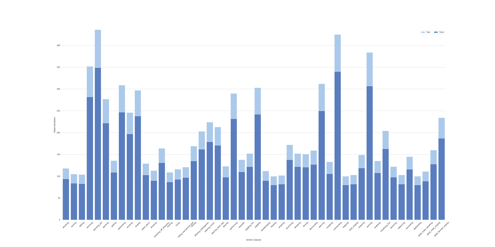

# Dark48
We build a dark video dataset named Dark48 for action recognition in the dark. 

The full dataset can be downloaded from:
[DaiduDrive]()




## Dark Video Evaluation
The source code of the proposed dark video evaluation method.
```
import os
import cv2
import numpy as np
from decord import VideoReader

def dark_img(img, threshold = 0.877):
    YCrCb = cv2.cvtColor(img, cv2.COLOR_RGB2YCrCb)
    Y = YCrCb[:,:,0]
    # Determine whether image is bright or dimmed
    exp_in = 112 # Expected global average intensity 
    M,N = img.shape[:2]
    mean_in = np.sum(Y/(M*N)) 
    t = (mean_in - exp_in)/ exp_in
    
    # Check image
    if t < -threshold: # Dimmed Image
        return True
    else:
        return False

def dark_video(video, segments=8, threshold = 0.877):
    vr = VideoReader(video)
    seg = int(len(vr) / segments)
    sample_id = [seg*i+int(seg/2) for i in range(0, segments)]
    frames = vr.get_batch(sample_id).asnumpy()
    video_t = 0
    for i in range(len(sample_id)):
        img = frames[i]
        img_t = dark_img(img)
        video_t += img_t
    if video_t/segments >= threshold:
        return True
    else:
        return False
```

